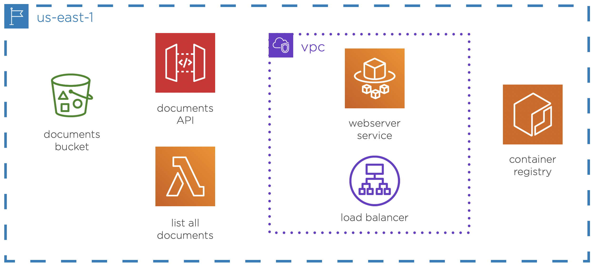

# Infrastructure as Code
Well, I was excited enough to launch my infrastructure as code on AWS cloud using AWS CDK. After all, who doesn't want to leverage the benefits of development workflow to avoid the embarrassing errors we are all destined to make manually!

## Architecture of resources provisioned on AWS

